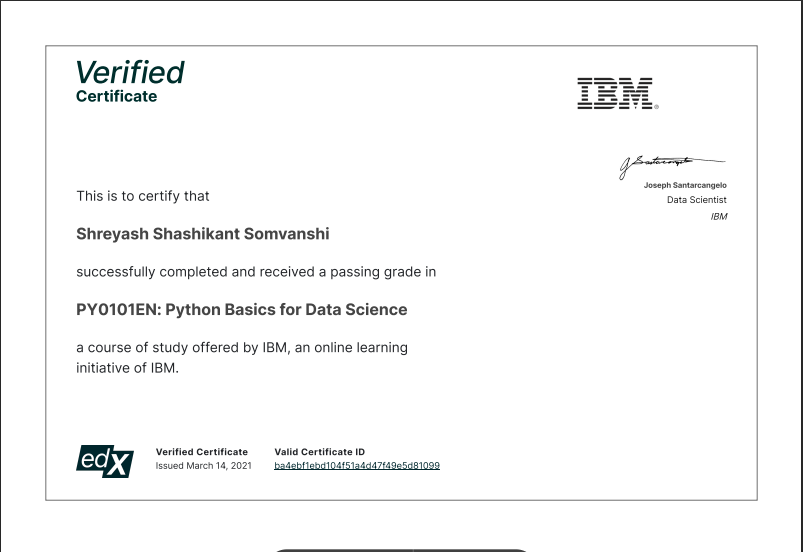

---

### Learnings:
+ Python Basics
+ Python Data Structures
+ Python Programming Fundamentals
+ Working with Data in Python
+ Working with Numpy Arrays

---
#### Course Link: [https://www.edx.org/learn/python/ibm-python-basics-for-data-science](https://www.edx.org/learn/python/ibm-python-basics-for-data-science)
---
