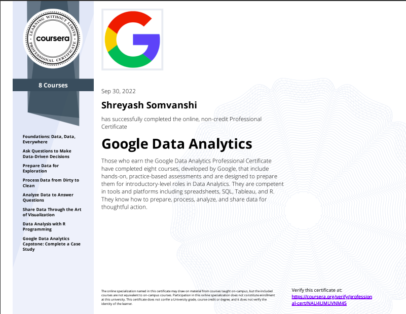

---
### Learnings:
+ Foundations: Data, Data, Everywhere
+ Ask Questions to Make Data-Driven Decisions
+ Prepare Data for Exploration
+ Process Data from Dirty to Clean
+ Analyze Data to Answer Questions
+ Share Data Through the Art of Visualization
+ Data Analysis with R Programming

---
#### Course Link: [https://www.coursera.org/professional-certificates/google-data-analytics](https://www.coursera.org/professional-certificates/google-data-analytics)
---
